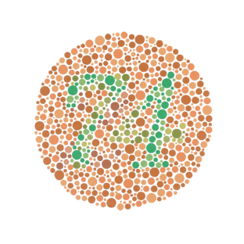

Sometimes I write about articles about the professional world! Here's the links if you want a quick read.

<ul line-style-type="none">
	<li>
		</img>
		<a href="https://www.linkedin.com/pulse/yes-nos-subarus-what-sales-can-learn-consent-practices-matthew-bogert">Yes'​, No's, and Subaru's: What Sales Can Learn About Consent Practices</a>
	</li>
	<li>
		</img>
		<a href="https://www.linkedin.com/pulse/how-i-understood-impostor-syndrome-through-dance-matthew-bogert">How I Understood Impostor Syndrome Through Dance</a>
	</li>	
	<li>
		</img>
		<a href="https://www.linkedin.com/pulse/your-user-colorblind-now-what-accessibility-use-cases-matthew-bogert">Your user is colorblind, now what? Accessibility and Use Cases in Tech</a>
	</li>
</ul>
